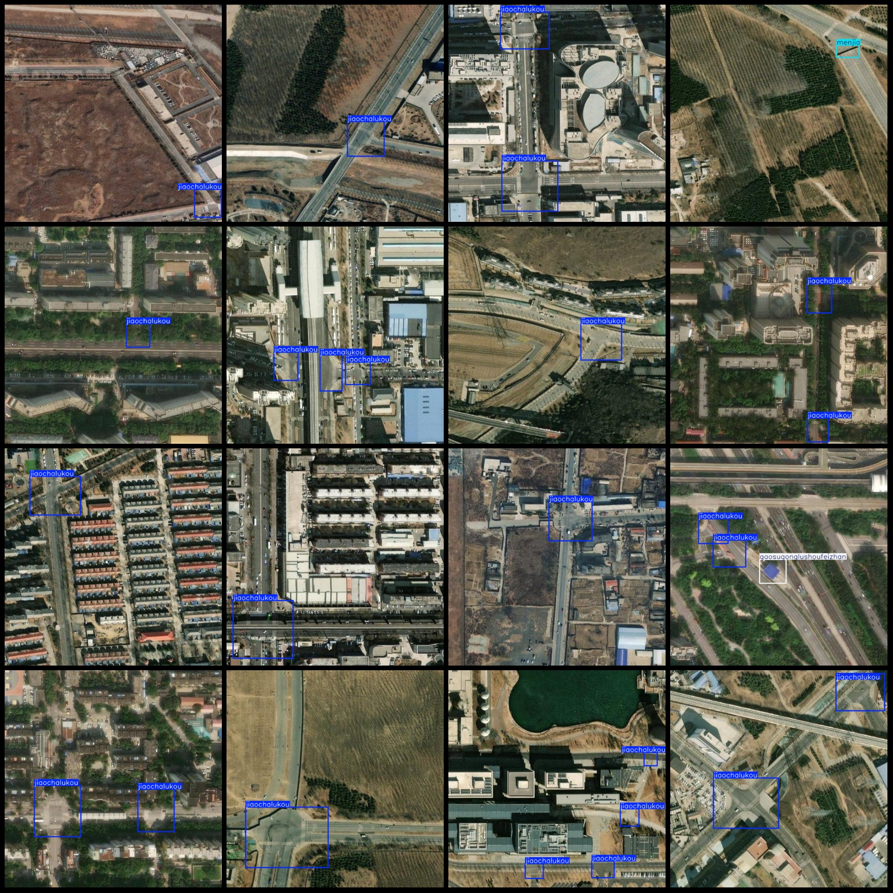
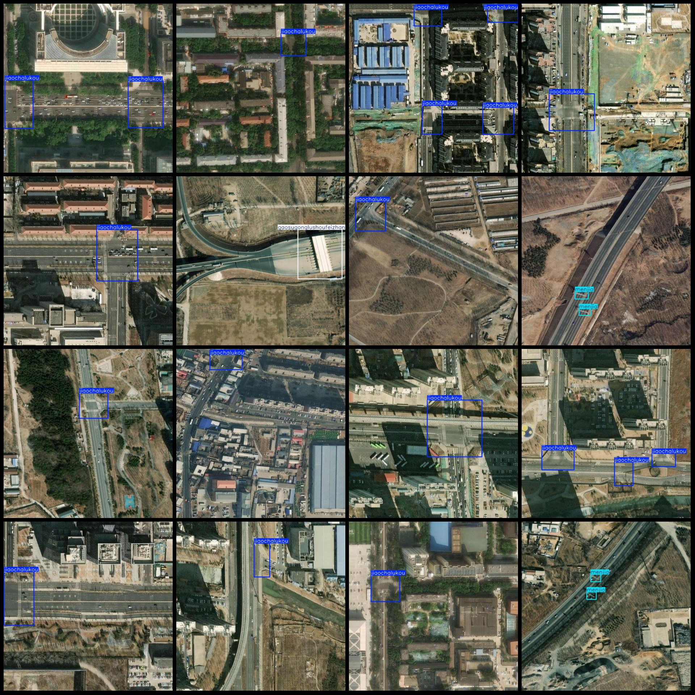

# Drone Viewpoint Aerial Photography Traffic Junction Facilities Toll Station, Bridges, Signal Box Intersection Tunnel Testing Dataset - VOC+YOLO Format - 902 Images in 5 Categories

Dataset Format: Pascal VOC format + YOLO format (without split path txt file, only containing jpg images and corresponding VOC format xml files and YOLO format txt files)
Number of Images (jpg file count): 902
Number of Annotations (xml file count): 902
Number of Annotations (txt file count): 902
Number of Annotation Categories: 5
Annotation Category Names (note that the order of categories in YOLO format is not consistent with this, and should be based on the labels folder classes.txt): ["Highway Toll Station", "Bridge", 
"Signal Box", "Intersection", "Tunnel Entrance"]
Corresponding Chinese Category Names: ["Highway Toll Station", "Bridge", "Signal Box", "Intersection", "Tunnel Entrance"]
Box Count for Each Category:
- Highway Toll Station = 36
- Jiaochalukou = 1181
- Menjia = 110
- Qiaoliang = 60
- Suidaorukou = 36
Total Boxes: 1423
Boxes per Image for Each Category:
- Highway Toll Station = 28
- Jiaochalukou = 791
- Menjia = 60
- Qiaoliang = 51
- Suidaorukou = 23
Image Resolution: 640x640
Annotation Tool Used: labelImg
Annotation Rules: Draw boxes around categories
Important Notice: The dataset does not have separate training, validation, or test sets; users are required to partition these themselves.
Special Remark: This dataset does not guarantee any accuracy improvement from trained models or weight files.
Image Preview:

## Images

Here is a pay link on Stripe ( https://buy.stripe.com/3cs8yP7sY87d0vu9AB ). Please contact me lonlonago@foxmail.com after funding $89, and I will send you a complete data files , thank you!

